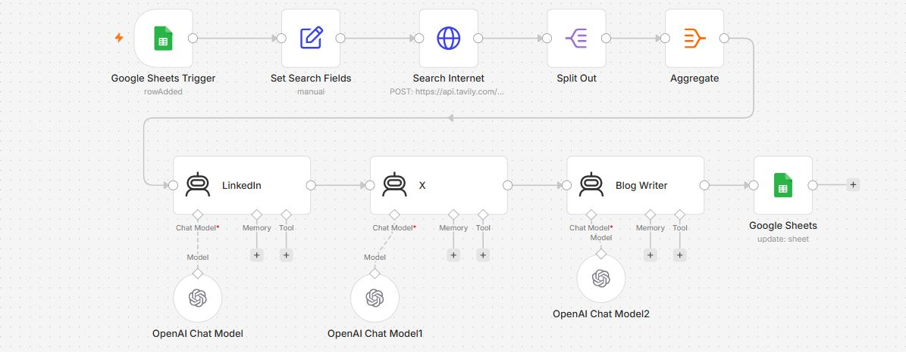

# Multi AI Research & Content Creation System using n8n


---

# 📖 Overview

This n8n workflow automates the complete content research and content creation process using multiple AI agents.

Whenever a new topic is added into Google Sheets, the workflow automatically performs internet research using Tavily Search API, aggregates the collected information, and sends the structured research to multiple AI agents that independently generate:

* LinkedIn Posts
* X (Twitter) Posts
* Long-form Blog Articles

Finally, the generated content is written back to Google Sheets for review, editing, or publishing.

This workflow eliminates repetitive research work while maintaining high-quality content across multiple publishing platforms.

---
# 🖼️ Workflow Layout



---

# ✨ Features

* 📑 Google Sheets Trigger
* 🌍 Automatic Internet Research
* 🔎 Tavily AI Search Integration
* 🤖 Multiple AI Agents
* 💼 LinkedIn Content Generator
* 🐦 X (Twitter) Content Generator
* ✍️ AI Blog Writer
* 📊 Google Sheets Output
* ⚡ Fully Automated Pipeline
* 📝 Structured Content Generation

---

# 🎯 Use Cases

### 📢 Content Marketing

Automatically create platform-specific content from a single topic.

### 💼 LinkedIn Marketing

Generate professional LinkedIn posts using AI.

### 🐦 Social Media Automation

Create engaging Twitter/X posts for daily publishing.

### 📰 Blog Writing

Generate SEO-friendly blog articles from researched information.

### 🏢 Marketing Agencies

Scale content production for multiple clients.

### 🤖 AI Research Assistant

Automate internet research before generating content.

---

# ⚙ Workflow Nodes

---

## 1️⃣ Google Sheets Trigger

### 📌 Node Type

Google Sheets Trigger

### 🎯 Purpose

Starts the workflow whenever a new row is added into the configured Google Sheet.

### ⚙ Configuration

* Trigger Event:

  * Row Added

* Spreadsheet:

  * Content Planning Sheet

* Sheet:

  * Research Queue

### Expected Input

| Topic                   | Category   | Audience   |
| ----------------------- | ---------- | ---------- |
| Artificial Intelligence | Technology | Developers |

### Output

Automatically passes the newly added row to the workflow.

---

## 2️⃣ Set Search Fields

### 📌 Node Type

Set Node

### 🎯 Purpose

Formats and prepares the search query before calling Tavily Search API.

### Operations

Creates variables including:

* Topic
* Search Query
* Audience
* Search Intent

### Example Output

```json
{
  "query":"Latest Artificial Intelligence Trends 2026",
  "audience":"Software Developers"
}
```

---

## 3️⃣ Search Internet

### 📌 Node Type

HTTP Request

### 🎯 Purpose

Calls Tavily Search API to retrieve recent and relevant web information.

### Method

POST

### API

```
https://api.tavily.com/search
```

### Parameters

| Parameter    | Value               |
| ------------ | ------------------- |
| api_key      | YOUR_TAVILY_API_KEY |
| query        | AI Topic            |
| max_results  | 5                   |
| search_depth | advanced            |

### Output

Returns multiple relevant search results.

Example

```json
{
"title":"OpenAI launches new model",
"url":"https://..."
}
```

---

## 4️⃣ Split Out

### 📌 Node Type

Split Out

### 🎯 Purpose

Processes each search result independently before aggregation.

### Benefits

* Parallel processing
* Cleaner data handling
* Easier aggregation

### Output

Individual search result items.

---

## 5️⃣ Aggregate

### 📌 Node Type

Aggregate

### 🎯 Purpose

Combines all search results into one structured research document.

### Operations

* Merge titles
* Merge descriptions
* Merge URLs
* Preserve ordering

### Output Example

```
Research Summary

Article 1
...

Article 2
...

Article 3
...
```

---

## 6️⃣ LinkedIn AI Agent

### 📌 Node Type

AI Agent

### 🎯 Purpose

Generates a professional LinkedIn post using the aggregated research.

### Connected Model

OpenAI Chat Model

### Responsibilities

* Professional tone
* Business audience
* CTA generation
* Hashtags
* Emoji formatting

### Prompt Example

```
Write a professional LinkedIn post based on the provided research.
```

### Output

```
🚀 Artificial Intelligence continues to transform...

#ArtificialIntelligence
#Technology
```

---

## 7️⃣ X (Twitter) AI Agent

### 📌 Node Type

AI Agent

### 🎯 Purpose

Creates concise, engaging content optimized for X (formerly Twitter).

### Connected Model

OpenAI Chat Model

### Responsibilities

* Short-form writing
* Hook sentence
* Character-efficient formatting
* Relevant hashtags

### Example Output

```
AI agents are changing the future of software development.

#AI #OpenAI
```

---

## 8️⃣ Blog Writer AI Agent

### 📌 Node Type

AI Agent

### 🎯 Purpose

Generates a complete blog article based on the aggregated research.

### Connected Model

OpenAI Chat Model

### Responsibilities

* SEO-friendly title
* Introduction
* Main sections
* Conclusion
* Professional writing style

### Output Example

```
# Future of Artificial Intelligence

Artificial Intelligence has become one of the fastest-growing technologies...
```

---
# Part 2 — README.md

---

# ⚙ Workflow Nodes (Continued)

## 9️⃣ Google Sheets (Update Sheet)

### 📌 Node Type

Google Sheets

### 🎯 Purpose

Stores the AI-generated content back into the spreadsheet so it can be reviewed, edited, or published later.

### Operation

Update Row

### Configuration

* Spreadsheet ID
* Worksheet Name
* Row Number
* Column Mapping

### Example Column Mapping

| Column        | Value               |
| ------------- | ------------------- |
| Topic         | AI Agents           |
| Research      | Aggregated Research |
| LinkedIn Post | Generated Content   |
| X Post        | Generated Tweet     |
| Blog          | Generated Blog      |
| Status        | Completed           |

### Output

The spreadsheet is automatically updated with all generated content.

---

## 🔟 OpenAI Chat Models

### 📌 Node Type

OpenAI Chat Model

### 🎯 Purpose

Provides LLM capabilities to all AI Agent nodes.

### Model

```
GPT-4o-mini
```

### Parameters

| Parameter       | Value    |
| --------------- | -------- |
| Temperature     | 0.7      |
| Max Tokens      | 2000     |
| Response Format | Text     |
| Streaming       | Disabled |

### Used By

* LinkedIn AI Agent
* X AI Agent
* Blog Writer AI Agent

---

# 🔐 Required Credentials

## 🤖 OpenAI

Required

* OpenAI API Key

Used For

* LinkedIn generation
* X post generation
* Blog writing

---

## 🌐 Tavily Search API

Required

* Tavily API Key

Used For

* Internet research
* Search latest information
* Collect trusted references

---

## 📊 Google Sheets

Required

Google OAuth2 Credential

Permissions

* Read Spreadsheet
* Update Spreadsheet

Used For

* Trigger workflow
* Store generated content

---

# 📥 Installation

### Step 1

Import the Multi_AI_Agent_System_for_Research___Content_creation.json into n8n.

---

### Step 2

Create an OpenAI credential.

---

### Step 3

Add your OpenAI API Key.

---

### Step 4

Create a Tavily API credential.

---

### Step 5

Replace

```
YOUR_TAVILY_API_KEY
```

with your API key.

---

### Step 6

Connect Google Sheets OAuth credential.

---

### Step 7

Update Spreadsheet ID.

---

### Step 8

Map the worksheet columns.

---

### Step 9

Run the workflow manually.

---

### Step 10

Enable the workflow.

---

# 🎨 Customization

## 🌍 Change Search Depth

Modify Tavily API parameters.

Examples

* basic
* advanced

---

## 🔎 Increase Search Results

Change

```
max_results = 5
```

to

```
10
```

or

```
20
```

---

## 💼 Customize LinkedIn Tone

Modify the LinkedIn AI prompt.

Examples

* Corporate
* Startup
* Personal Branding
* Educational

---

## 🐦 Customize X Posts

Generate

* Thread
* Single Tweet
* Viral Style
* News Style

---

## ✍ Generate Longer Blogs

Increase prompt instructions.

Example

```
Generate a 1500-word SEO blog article.
```

---

## 📑 Add Additional AI Agents

Examples

* Facebook Content
* Instagram Caption
* Medium Article
* Reddit Post
* Email Newsletter

---

# 🛠 Troubleshooting

## ❌ OpenAI Error

**Cause**

Invalid API Key.

**Solution**

Verify the OpenAI credential.

---

## ❌ Tavily Search Error

**Cause**

Expired API key or exceeded usage limit.

**Solution**

Generate a new API key or upgrade your Tavily plan.

---

## ❌ Google Sheets Permission Error

**Cause**

OAuth permissions not granted.

**Solution**

Reconnect the Google Sheets credential and ensure edit access to the spreadsheet.

---

## ❌ No Search Results

**Cause**

The search query is too broad or API returned no relevant matches.

**Solution**

Use more specific keywords or increase `max_results`.

---

## ❌ AI Output Too Generic

**Cause**

Prompt lacks sufficient context.

**Solution**

Include audience, tone, objectives, and desired output format in the prompt.

---

# 💻 Technologies Used

* n8n
* OpenAI GPT-4o-mini
* Tavily Search API
* Google Sheets
* AI Agents
* HTTP Request Node
* Aggregate Node
* Split Out Node
* JavaScript

---

# 🚀 Future Improvements

* Multi-language content generation
* SEO keyword optimization
* AI-generated featured images
* Automatic WordPress publishing
* LinkedIn direct publishing
* X (Twitter) API integration
* Facebook & Instagram publishing
* Content quality scoring
* Plagiarism detection
* Email newsletter generation
* Content approval workflow
* Analytics dashboard
---

# 🤝 Contributing

Contributions are welcome! Feel free to fork this repository, submit pull requests, report issues, or suggest improvements to make this workflow even more powerful.

---

# ⭐ Support

If this workflow helped you, please consider giving the repository a **⭐ Star** on GitHub. It helps others discover the project and supports future development.
